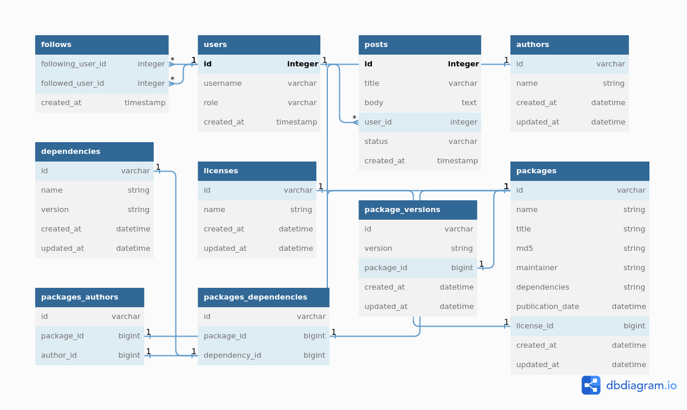

## r-cran-indexer

### Prerequisites

The setup steps expect the following tools installed on the system.

- [Ruby (2.7.6 recommended)](https://github.com/organization/project-name/blob/master/.ruby-version#L1)
- [Postgres (14.x recommended)](https://www.postgresql.org/download/) at port 5432 with default user and password (`postgres` and `postgres`)
- [Redis (7.x recommended)](https://redis.io/docs/getting-started/installation/) at port 6379

In case you use `docker compose` and want to install `Postgres` and `Redis` services using docker run:

```bash
docker-compose up -d # or docker compose up if you are using docker compose v2
```

### 1. Create and setup the database

Run the following commands to create and setup the database.

```ruby
rails db:setup
```

### 2. Start the server

You can start the rails server using the command given below. This command will power the async process that will execute package indexation once it starts.

```ruby
foreman start -f Procfile.dev
```

Keep the server running while executing the sync task.

### 3. Run the first packages sync

And finally, to kick-off the first sync:

```ruby
rails packages:sync
```

Visit sidekiq page to follow packages sincronization at [http://localhost:3000/sidekiq](http://localhost:3000/sidekiq)

### Tests

To run test suite:

```ruby
rails test
```

### Aditionals

Packages that are in the manifest but could not be found in the cran server can be listed with:

```bash
cat log/development.log | grep "not found"
```

Packages that are in the served but could not be created (invalid compression, corrupted, etc) can be listed with:

```bash
cat log/development.log | grep "malformed"
```

---

### Architecture and models

The problem was mapped to a Rails application by creating models to represent the required package information. These models include `Package`, `Author`, `License`, `Dependency`, and `PackageVersion`. Following a diagram showing more about how the problem was structured:



After reading the `PACKAGE.gz` a job for each package is created. The job is responsible for getting the missing fields from the `package.tar.gz` and them consolidate the package.

`PackagesIndexer` is the entrypoint, following from this class will help to understand how these everything materializes together.

### Known bottlenecks

- The syncronization process depends on cran server network. Once the server has considerable limits the biggest packages can take several minutes to sync. From tests it could ingest around 1000 packages per minute. That means a server can take up to 20 minutes to be finishe a fully syncronization. Syncs after the first one should be faster once they just try to update or create if the package `MD5sum` was not ingested yet.

### Incomplete

There are some incomplete parts that were not done duo time limit:

- New packages are added on new runs but **existing packages are not updated**.

### Potential areas of improvement

Things that could use from more attention:

- Validate relation straight from models
- Add a proper data factory (a.k.a: `factorybot`)
- A proper way to see packages already sync, today `rails c` is the way to go.
- Improve handling for job errors, current state ignore the ones that are not recoverable but doesn't handle some of them.
